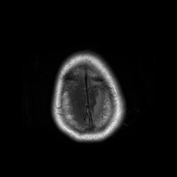
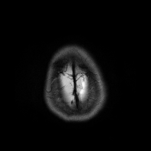
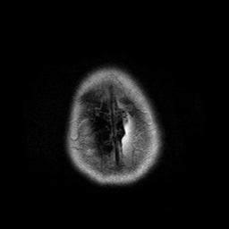

# pediatric-cancer

## Brain MRI Image Classification

| T1                                | T2                                | Flair                                   |
| --------------------------------- | --------------------------------- | --------------------------------------- |
|  |  |  |

## Index

-   [Folder Structure](#folders)
-   [Generated Folders](#genfolders)
-   [Introduction to Files](#intro2files)
-   [Execution](#execution)

<a name="folders"/>
## Folder Structure

### docs

-   **Example_Images** - Example images to show how MRI scans look like
-   **Presentation** - Material associated with final Presentation
-   **Public_Networks** - The public ImageNet based Image Classification models tested, and sample images that showcase which kind of features the network is learning.
    -   **inception_features** - features which Inception V3 learns
    -   **inception_resnet_features** - features which InceptionResNet V2 learns
    -   **resnet_features** - features which ResNet50 learns

### datasets

-   **BRAIN_TUMOR** - Folder to store the images from Grand Challenge Dataset (download and extract from [Grand-Challenge](https://drive.google.com/open?id=1A2IU8Sgea1h3fYLpYtFb2v7NYdMjvEhU))
    -   **imagesTr** - Training images in nii.gz format
    -   **imagesTs** - Testing images in nii.gz format
    -   **labelsTr** - Training labels in nii.gz format (for segmentation only)
    -   **dataset.json** - File descriptors
-   **Stanford** - Folder to store Stanford images
    -   **DIPG** - Diffuse Intrinsic Pontine Glioma images like `DIPG-patient_*.dcm`
    -   **EP** - Etoposide and Cisplastin images like `EP-StanEP*.dcm`
    -   **MB** - Medulloblastoma images like `MB-StanMB*.dcm`

### notebooks

Folder to store iPython notebooks

<a name="genfolders"/>
## Generated Folders

### models

Generated by `resnet_50.py`, `train_resnet_50.py` and `train_classifier.py`. Contains the HDF5 files of AutoEncoder and Classification models.

### logs

Generated by `resnet_50.py`, `train_resnet_50.py` and `train_classifier.py`. Contains the Tensorboard logs of AutoEncoder and Classification models.

### train_ae_data

Generated by `AutoEncoder-Normalized-Preprocessing.py`. Contains the normalized Grand Challenge images.

-   **T2W** - T2 modality images

### ae_data

Generated by `AutoEncoder-PerPlane-Preprocessing.py`. Contains the per-plane normalized Grand Challenge images.

-   **T2W** - T2 modality images

### normal_classifier_data

Generated by `Classification-Preprocessing.py`. Contains the normalized Stanford Images.

-   **train** - Training images
-   **test** - Testing images
