# InceptionResnetV2 Feature Visualization

## 1st Layer - Convolution

|     Filter     |     Filter     |     Filter     |     Filter     |     Filter     |     Filter     |     Filter     |     Filter     |
| :------------: | :------------: | :------------: | :------------: | :------------: | :------------: | :------------: | :------------: |
| 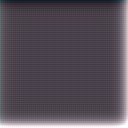 | 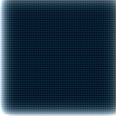 |  |  |  | 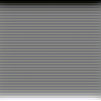 |  |  |
| 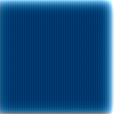 |  | 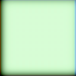 | 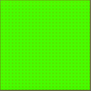 |  |  | 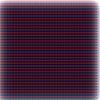 | 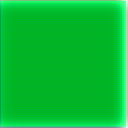 |
| 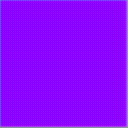 |  |  | 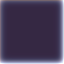 | 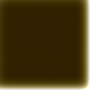 |  | 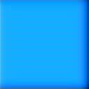 |  |
|  | 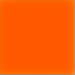 |  |  | 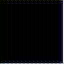 |  | 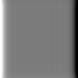 |  |

## 2nd Layer - Convolution

|     Filter     |     Filter     |     Filter     |     Filter     |     Filter     |     Filter     |     Filter     |     Filter     |
| :------------: | :------------: | :------------: | :------------: | :------------: | :------------: | :------------: | :------------: |
|  | 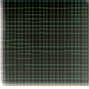 | 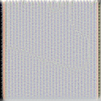 |  | 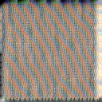 | 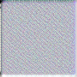 | 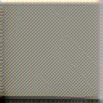 | 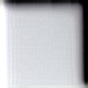 |
| 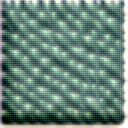 | 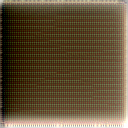 | 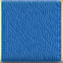 | 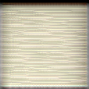 |  | 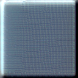 | 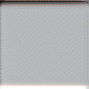 | 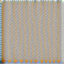 |
| 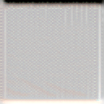 |  | 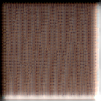 | 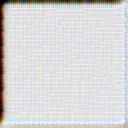 |  | 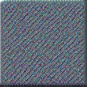 | 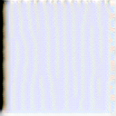 | 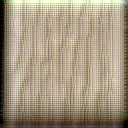 |
|  | 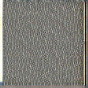 | 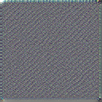 | 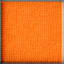 | 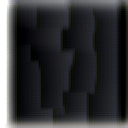 |  | 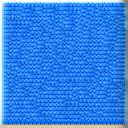 | 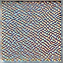 |
| 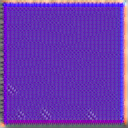 | 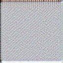 | 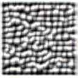 | 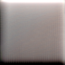 | 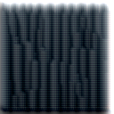 | 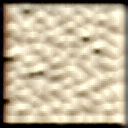 |  | 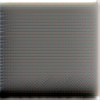 |
| 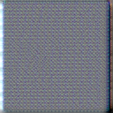 | 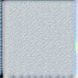 | 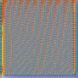 |  |  |  |  |  |
|  |  |  |  |  |  |  |  |
|  |  |  |  |  |  |  |  |

## 3rd Layer - Convolution

|     Filter     |     Filter     |     Filter     |     Filter     |     Filter     |     Filter     |     Filter     |     Filter     |
| :------------: | :------------: | :------------: | :------------: | :------------: | :------------: | :------------: | :------------: |
|  |  |  |  |  |  |  |  |
|  |  |  |  |  |  |  |  |
|  |  |  |  |  |  |  |  |
|  |  |  |  |  |  |  |  |
|  |  |  |  |  |  |  |  |
|  |  |  |  |  |  |  |  |
|  |  |  |  |  |  |  |  |
|  |  |  |  |  |  |  |  |

## 4th Layer - Concatenation

|     Filter     |     Filter     |     Filter     |     Filter     |     Filter     |     Filter     |     Filter     |     Filter     |
| :------------: | :------------: | :------------: | :------------: | :------------: | :------------: | :------------: | :------------: |
|  |  |  |  |  |  |  |  |
|  |  |  |  |  |  |  |  |
|  |  |  |  |  |  |  |  |
|  |  |  |  |  |  |  |  |
|  |  |  |  |  |  |  |  |
|  |  |  |  |  |  |  |  |
|  |  |  |  |  |  |  |  |
|  |  |  |  |  |  |  |  |

## 5th Layer - Addition

|     Filter     |     Filter     |     Filter     |     Filter     |     Filter     |     Filter     |     Filter     |     Filter     |
| :------------: | :------------: | :------------: | :------------: | :------------: | :------------: | :------------: | :------------: |
|  |  |  |  |  |  |  |  |
|  |  |  |  |  |  |  |  |
|  |  |  |  |  |  |  |  |
|  |  |  |  |  |  |  |  |
|  |  |  |  |  |  |  |  |
|  |  |  |  |  |  |  |  |
|  |  |  |  |  |  |  |  |
|  |  |  |  |  |  |  |  |

## 6th Layer - Addition

|     Filter     |     Filter     |     Filter     |     Filter     |     Filter     |     Filter     |     Filter     |     Filter     |
| :------------: | :------------: | :------------: | :------------: | :------------: | :------------: | :------------: | :------------: |
|  |  |  |  |  |  |  |  |
|  |  |  |  |  |  |  |  |
|  |  |  |  |  |  |  |  |
|  |  |  |  |  |  |  |  |
|  |  |  |  |  |  |  |  |
|  |  |  |  |  |  |  |  |
|  |  |  |  |  |  |  |  |
|  |  |  |  |  |  |  |  |